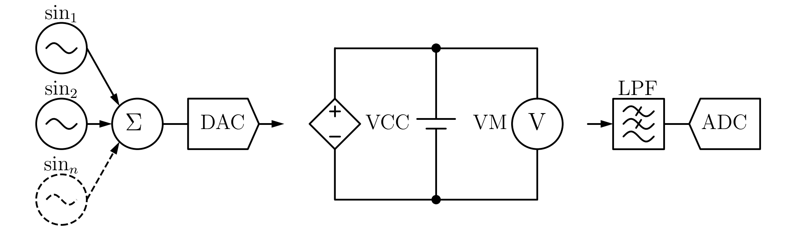
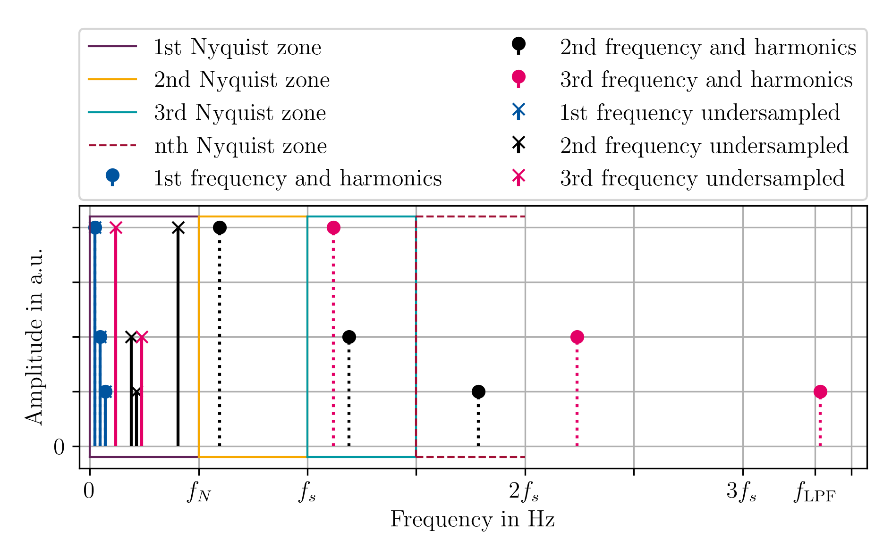
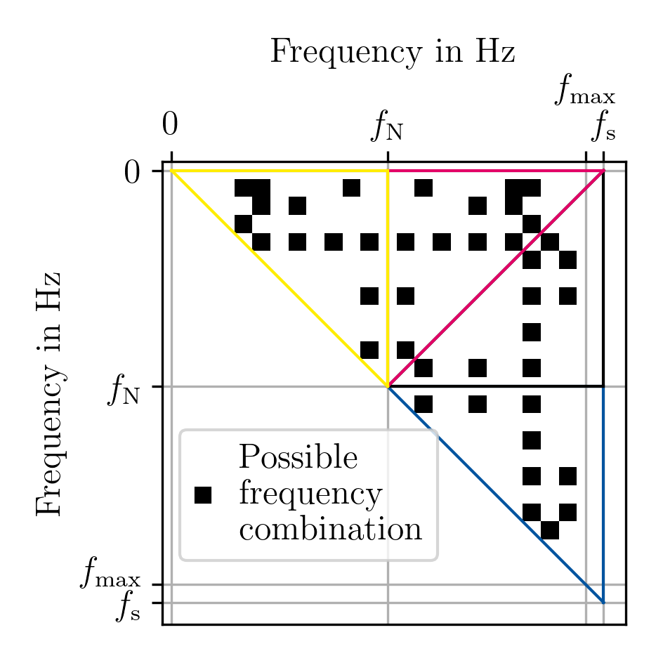
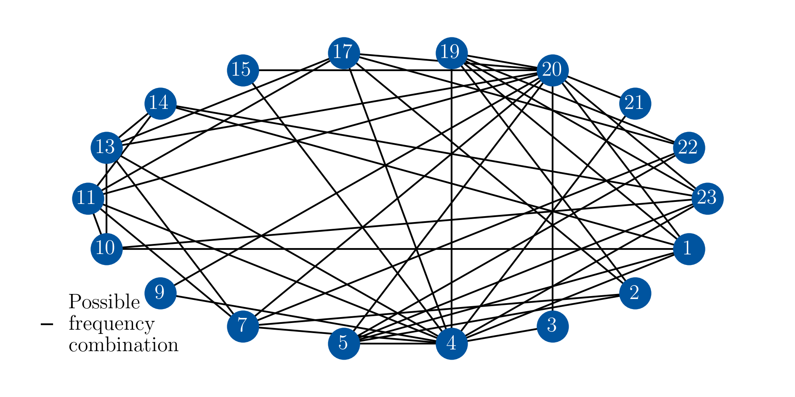

# Frequency Selection Tool for Undersampling Multisine Signals

<a href="https://www.carl.rwth-aachen.de/?lidx=1" target="_blank">
    
</a>

# Undersampling Multisine Signals


[](https://opensource.org/licenses/MIT) [](https://mybinder.org/v2/git/https%3A%2F%2Fgit.rwth-aachen.de%2Fisea%2Fundersampling-multisine-signals/main)

*Undersampling Multisine Signals* is a tool for selecting frequencies of a multisine signal that do not overlap in the frequency domain in undersampling conditions. A detailed example is described in the conference proceedings of [1] (README.md#sources). An application example for multisine signals can be found in [2](README.md#sources).  

- [Getting Started](README.md#getting-started)
- [Example Usage](README.md#example-usage)
- [Colophon](README.md#colophon)
- [Further Information](README.md#further-information)
- [FAQ](README.md#faq)
- [Sources](README.md#sources)


We want to find a frequency combination that can be used for multisine signals with undersampling. It is assumed that the following signal path exists:  
.  
The following could therefore be measured in the frequency range:  
.  
To solve this problem, we first create an adjacency matrix that contains information on whether any two frequencies can be combined:  
.  
This adjacency matrix is then mapped onto a graph. In this graph, cliques are then searched for that are equivalent to frequencies that can be used together for excitation.  
.  

# Getting Started
1.  Clone the project.
	```bash
    git clone https://git.rwth-aachen.de/isea/undersampling-multisine-signals.git
    ```
2. Install Python 3.11.9 (https://www.python.org/downloads/)
3. Open an prompt and navigate to the path of this project
    ```bash
    cd path_to_this_project
    ```
4. Follow the instructions of the [Python Read the Docs](https://docs.python.org/3.11/library/venv.html) to create an virtual environment (venv) and activate it. E.g.:  
	**Windows**
    ```bash
    python -m venv .venv
    .\.venv\Scripts\activate
    ```
    **Linux / Mac**
    ```bash
    python -m venv .venv
    . .venv/bin/activate
    ```

5. Install all necessary packages with:  
    **Windows**
	```bash
    pip install -r requirements_windows.txt
    ```
    **Linux / Mac**
	```bash
    pip install -r requirements.txt
    ```
6. (Optional) Clean up your venv:
	```bash
    python -m pip cache purge
    ```
7. Open this project with an Jupyter-Notebook editor of your choice, e.g. [VS Code](https://code.visualstudio.com/Download) (needs to be installed separatly) with:
    ```bash
    code
    ```

# Example Usage
Details and step-by-step explanations can be found in the Jupyter Notebooks:
- [multisine.ipynb](multisine.ipynb)


# Colophon

Thanks to <a href="https://orcid.org/0000-0001-7785-6569">Hendrik Zappen </a>, who supported me <a href="https://orcid.org/0000-0003-0943-9485">Alexander Blömeke </a>.

## Related Publications / Citation

You can cite an archived version of this prepository: [https://doi.org/10.18154/RWTH-2024-09502](https://doi.org/10.18154/RWTH-2024-09502).  
Please cite our papers: https://publications.rwth-aachen.de/record/816942, https://doi.org/10.3390/batteries4040064

Archived versions of this git:  
Release v0.1.0: [https://doi.org/10.18154/RWTH-2024-09502](https://doi.org/10.18154/RWTH-2024-09502)

## License

This project is licensed according to the file [LICENSE](/LICENSE "LICENSE").

# Further Information


## Developer Info

This project is written in [Python 3.11.9](https://www.python.org/) using [Visual Studio Code](https://code.visualstudio.com/) and [Jupyter Notebooks](https://jupyter.org/) in an Python virtual environment on Windows.
A [requirements.txt](requirements.txt) can be created by:

```bash
pip freeze -l > requirements.txt
```

## Git and Jupyter Notebooks
Consider to ignore the Jupyter Outputs in Git:

```bash
git config filter.strip-notebook-output.clean 'jupyter nbconvert --ClearOutputPreprocessor.enabled=True --to=notebook --stdin --stdout --log-level=ERROR'
```


# FAQ
- **pywin32 fails**: https://github.com/microsoft/vscode-jupyter/wiki/Failure-to-start-kernel-due-to-failures-related-to-win32api-module


# Sources
[1] https://publications.rwth-aachen.de/record/816942  
[2] https://doi.org/10.3390/batteries4040064